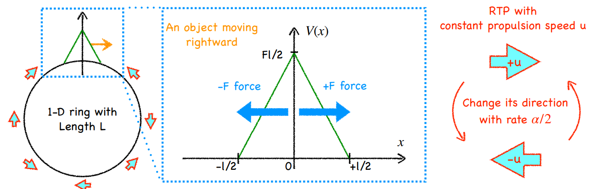
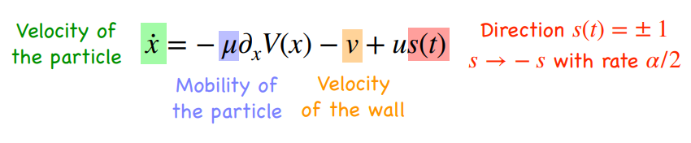

# numerical simulation of RTP fluid & symmetric passive particle

'an object gains motility in an active fluid throug spontaneous symmetry breaking'

Kiwon Kim, Yunsik Choe, Yongjoo Baek

Dept. of Physics and Astronomy, Seoul National University

# 1. model : overdamped RTP

## active particle dynamics in passive object frame

(K. W. Kim et al 2020-1 KPS poster)

## passive object dynamics in lab frame

$$\dot{X} = -\mu_p \partial_{X}{V(x-X)}$$

# code (numerical integration with random tumbling rate $\alpha$)

basic code and some usages are uploaded to github

[https://github.com/hulksiksik/RTP_git/blob/main/RTP_simul.py](https://github.com/hulksiksik/RTP_git/blob/main/RTP_simul.py)

# measurement
